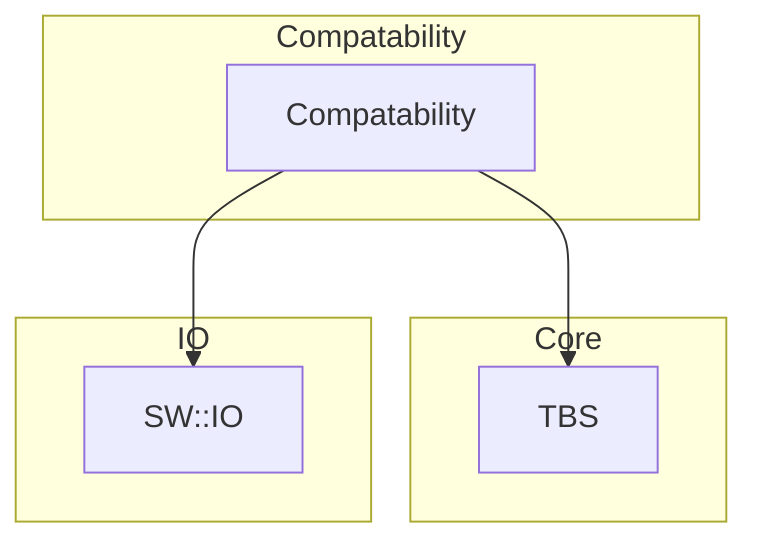

# Turn-Based Tactical Simulation

This project is a turn-based tactical game simulation with a clear, flexible, and scalable architecture. The core design principles are centered around **modularity**, **separation of concerns**, and the effective use of design patterns like **Polymorphism**, **Factories**, and the **Composite** pattern.

---

## 1. Core Concepts & Architecture

The simulation's architecture is built on a clear separation of layers, ensuring the core logic remains independent of the external API and data models. The system's flow can be understood through its primary components:

* **API Layer (`sw::io`)**: This layer acts as an adapter, translating raw input from external sources into a format usable by the simulation. It contains data structures for commands (`March`, `CreateMap`) and a parser (`CommandParser`) that handles this translation.

* **Core Simulation Layer (`sw::tbs`)**: This is the heart of the simulation. It contains the game loop (`Simulation`), the world state (`WorldContext`), and the core logic for all units and commands. It is agnostic to the API layer, interacting only with abstract interfaces.

* **Compatibility Layer (`Compatibilities`)**: This layer serves as a bridge, providing factories and wrappers that allow the core simulation to be extended without modifying its fundamental code. This is where the **Curiously Recurring Template Pattern (CRTP)** is heavily utilized to enable powerful, static polymorphism with zero runtime overhead.

---

## 2. Main Components in Detail

The simulation is built from several interconnected modules, each with a specific responsibility.

### World

The world state is managed by the `WorldContext`. It acts as a central container for all game data. The `Map` component handles unit positions and provides spatial queries, allowing for efficient searches for units within a specific range or cone distance.

### Units

All active entities in the simulation are represented by `Units`.

* **`Unit`**: A concrete class that acts as a container for components. It has no game logic of its own.

* **Components**: These are classes that contain specific data and logic, allowing for flexible unit creation. The core components are:
  * **Behaviour**: Defines the high-level actions of a unit.
  * **Movement**: Manages a unit's position and speed.
  * **Health**: Tracks a unit's health and processes damage.
  * **Attack**: Determines a unit's damage and attack range.

* **`UnitFactory`**: This factory uses CRTP to provide a unified interface for spawning different types of units, centralizing the creation logic. It assembles universal `Unit` objects by providing them with the correct set of components.

### Commands

A `Command` represents a specific action a unit can perform. The system uses a flexible and extensible approach for managing these actions.

* **`Command` (BaseCommand)**: The interface for all unit actions.

* **`CommandComposite`**: A realization of the **Composite pattern**. It allows complex behaviors to be built from simple commands, effectively serving as a **Behavior Tree** for units. It encapsulates a sequence or selection of actions.

* **Specific Commands**:
  * **`MoveCommand`**: Updates a unit's position if the target cell is free.
  * **`BaseAttackCommand`**: An abstract class that handles the core logic for checking and attempting to attack nearby units. It is specialized by different attack types.
  * **`MeleeAttackCommand`**: Specializes `BaseAttackCommand` by overriding the unit selection for melee range.
  * **`DistantAttackCommand`**: Specializes `BaseAttackCommand` by overriding the unit selection for ranged attacks.

* **`CommandFactory`**: Utilizes CRTP to enqueue commands for units, ensuring that commands are created and assigned correctly based on the unit's capabilities.

```mermaid
classDiagram
    direction LR

    subgraph Core Simulation
        class Simulation {
            -WorldContext _worldContext
            +void CreateWorld(const IVector2& size)
            +void SpawnUnit(BaseUnitFactory&& factory)
            +void QueueCommand(BaseCommandFactory&& factory)
            +void Run()
            -void Tick()
        }
        
        class WorldContext {
            -Map map
            -Unit[] units
            -BaseEventLogger logger
            -uint64_t tick
        }

        class Map {
            -uint32_t _width
            -uint32_t _height
            -vector~vector~uint32_t~~ _cells
            +void Create(const IVector2& size)
            +bool IsValidPosition(const IVector2& pos)
            +bool IsCellOccupied(const IVector2& pos)
            +void PlaceUnit(uint32_t unitId, const IVector2& pos)
            +void RemoveUnit(uint32_t unitId, const IVector2& pos)
            +unordered_set~uint32_t~ GetUnitInRadius(const UnitTable& units, const IVector2& pos, int radius)
            +vector~BaseUnit*~ GetUnitInRadius(const UnitTable& units, const IVector2& pos, int minRadius, int maxRadius)
        }
        
        WorldContext "1" -- "1" Map : has
        WorldContext "1" -- "1" BaseEventLogger : has
        WorldContext "1" -- "*" Unit : has
        Simulation "1" -- "1" WorldContext : manages
    end

    subgraph Units
        class Unit {
            -uint32_t _unitId
            -unique_ptr~BaseBehaviourComponent~ _behaviourComponent
            -unique_ptr~BaseMovementComponent~ _movementComponent
            -unique_ptr~BaseHealthComponent~ _healthComponent
            -unique_ptr~BaseAttackComponent~ _attackComponent
            -unique_ptr~BaseCommand~ _command
            +Unit(...) Unit
            +ActingState Act(WorldContext& worldContext)
            +uint32_t GetId() const
            +BaseBehaviourComponent& Behaviour()
            +BaseMovementComponent& Movement()
            +BaseHealthComponent& Health()
            +BaseAttackComponent& Attack()
        }
        
        Unit "1" o-- "1" BaseBehaviourComponent : has
        Unit "1" o-- "1" BaseMovementComponent : has
        Unit "1" o-- "1" BaseHealthComponent : has
        Unit "1" o-- "1" BaseAttackComponent : has
        BaseBehaviourComponent "1" o-- "*" BaseCommand : has

        class BaseBehaviourComponent {
            <<interface>>
            +void AddCommand(unique_ptr~BaseCommand~ command)
        }

        class SwordsmanBehaviourComponent
        class HunterBehaviourComponent
        BaseBehaviourComponent <|-- SwordsmanBehaviourComponent
        BaseBehaviourComponent <|-- HunterBehaviourComponent
        
        class BaseMovementComponent {
            <<interface>>
            +IVector2 GetPosition()
            +void MoveTo(WorldContext& worldContext, const IVector2& pos)
        }
        BaseMovementComponent <|-- InfantryMovementComponent

        class BaseHealthComponent {
            <<interface>>
            +uint32_t GetHealth()
            +DamageState AcceptAttack(WorldContext& worldContext, int damage, DamageReachability reachability)
        }
        BaseHealthComponent <|-- InfantryHealthComponent

        class BaseAttackComponent {
            <<interface>>
            +uint32_t GetAttackDamage(DamageReachability reachability)
            +uint32_t GetAttackDistance()
        }
        BaseAttackComponent <|-- MeleeAttackComponent
        BaseAttackComponent <|-- DistantAttackComponent
        
        class UnitFactory {
            -- CRTP --
            +unique_ptr~Unit~ SpawnUnit()
        }

        UnitFactory ..> Unit : creates
        UnitFactory ..> BaseBehaviourComponent : depends on
        UnitFactory ..> BaseMovementComponent : depends on
        UnitFactory ..> BaseHealthComponent : depends on
        UnitFactory ..> BaseAttackComponent : depends on
    end

    subgraph Commands
        class CommandFactory {
            -- CRTP --
            +unique_ptr~BaseCommand~ CreateCommandForUnit(Unit& unit)
            +void Visit(SwordsmanBehaviourComponent&)
            +void Visit(HunterBehaviourComponent&)
        }
        
        class CommandComposite {
            -BaseCommand[] _commands
            +void AddCommand(BaseCommand& command)
        }

        class BaseCommand {
            <<interface>>
            +void Execute(WorldContext& worldContext, Unit& unit)
        }

        CommandFactory ..> BaseBehaviourComponent : depends on
        CommandFactory ..> CommandComposite : creates
        CommandComposite "1" *-- "*" BaseCommand : aggregates

        BaseCommand <|.. CommandComposite
        BaseCommand <|.. MoveCommand
        BaseCommand <|.. BaseAttackCommand

        BaseAttackCommand <|-- MeleeAttackCommand
        BaseAttackCommand <|-- DistantAttackCommand
    end
    
    subgraph Logging
        class EventLog
        class EventLoggerWrapper {
            -- CRTP to wrap any logger --
        }
        class BaseEventLogger {
            <<interface>>
            +void LogMapCreated(uint64_t tick, const IVector2& size)
            +void LogMarchEnded(uint64_t tick, uint32_t unitId, const IVector2& destination)
            +void LogMarchStarted(uint64_t tick, uint32_t unitId, const IVector2& source, const IVector2& destination)
            +void LogUnitAttacked(uint64_t tick, uint32_t attackerUnitId, uint32_t targetUnitId, uint32_t damage, uint32_t targetHp)
            +void LogUnitDied(uint64_t tick, uint32_t unitId)
            +void LogUnitMoved(uint64_t tick, uint32_t unitId, const IVector2&)
            +void LogUnitSpawned(uint64_t tick, uint32_t unitId, const std::string& unitType, const IVector2& position)
        }

        BaseEventLogger <|-- EventLoggerWrapper
        EventLog "1" -- "1" EventLoggerWrapper : has
    end
```

---

## 3. Future Plans & Architectural Enhancements

The project is designed with scalability in mind. Future enhancements aim to leverage advanced C++ features for improved performance and developer experience:

* **Compile-Time Concepts**: Implementing C++ **Concepts** as contracts will ensure that any types used with our templates adhere to specific requirements, catching errors at compile-time rather than runtime. This guarantees type safety and provides clearer error messages.
* **Extendable unit base**: At any time any new unit with specific mechanics as 'Mine', 'Tower', and 'Crow' are possible to be added to the simulation.
* **Fractions**: To make gameplay of two or more players need to add fractions of units to make a competition between them.

