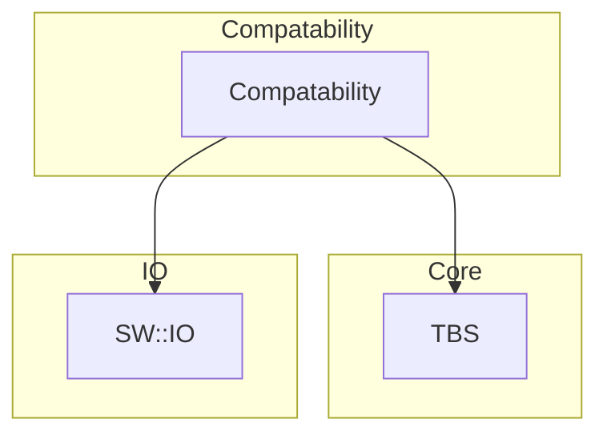

# Turn-Based Tactical Simulation

This project is a turn-based tactical game simulation built around an ECS (Entity-Component-System) architecture. The core design principles are **modularity**, **separation of concerns**, and leveraging **data-oriented design** with ECS while still using patterns like **Command** where helpful.

---

## 1. Core Concepts & Architecture (ECS)

The simulation's architecture is built on a clear separation of layers, ensuring the core logic remains independent of the external API and data models. The system's flow can be understood through its primary components:

* **API Layer**: Adapters that translate raw input into simulation commands and data.

* **Core Simulation Layer (`acid7beast::tbs`)**: Contains the game loop (`Simulation`), world state (`WorldContext`), `Registry` (entities/components), `Systems`, and `EventBus`.

* **Compatibility Layer**: Bridges external models to the core ECS types using lightweight wrappers.

---

## 2. Main Components in Detail

The simulation is built from several interconnected modules, each with a specific responsibility.

### World

The world state is managed by the `WorldContext`. It acts as a central container for all game data. The `Map` component handles unit positions and provides spatial queries, allowing for efficient searches for units within a specific range or cone distance.

### ECS: Entities, Components, Systems

* **Entities**: Identified by `EntityId` and managed by `Registry`. Entities are just IDs.

* **Components**: Plain data/logic containers attached to entities via `Registry` storages. Core components:
  * **BehaviourComponent**: Holds and executes queued commands per entity.
  * **MovementComponent**: Position/speed and moves entities on `Map`.
  * **HealthComponent**: Durability segments and damage processing.
  * **AttackComponent**: Weapons and reachability definitions.

* **Systems**: Operate over `Registry` and `WorldContext`:
  * **BehaviorsSystem**: Advances entity behavior via commands.
  * **CleanupSystem**: Removes dead entities and cleans transient state.

### Factories & Commands

Factories operate only through `Simulation`:
* `EntityFactory` builds entity components inside `Registry` using `WorldContext` (both provided by `Simulation`).
* `CommandFactory` creates `BaseCommand` instances for a target entity. `Simulation` enqueues the resulting commands into that entity's `BehaviourComponent`.

Commands represent actions executed by `BehaviourComponent`. The interface is `BaseCommand`; implementations include `MoveCommand`, `AttackCommand`, and composites via `CommandComposite`.

```mermaid
classDiagram
    direction LR

    subgraph Core Simulation
        class Simulation {
            -WorldContext _worldContext
            +void CreateWorld(const IVector2& size)
            +void SpawnEntity(BaseEntityFactory&& factory)
            +void EnqueueCommand(EntityId id, BaseCommandFactory&& factory)
            +void Run()
            -void Tick()
        }
        
        class WorldContext {
            -BaseEventLogger logger
            -uint64_t tick
            -Map map
            -EventBus eventBus
            -vector~EntityId~ turnOrder
        }

        class Map {
            -uint32_t _width
            -uint32_t _height
            -vector~vector~uint32_t~~ _cells
            +void Create(const IVector2& size)
            +bool IsValidPosition(const IVector2& pos)
            +bool IsCellOccupied(const IVector2& pos)
            +void PlaceUnit(uint32_t unitId, const IVector2& pos)
            +void RemoveUnit(uint32_t unitId, const IVector2& pos)
            +unordered_set~uint32_t~ GetUnitInRadius(const UnitTable& units, const IVector2& pos, int radius)
            +vector~BaseUnit*~ GetUnitInRadius(const UnitTable& units, const IVector2& pos, int minRadius, int maxRadius)
        }
        
        WorldContext "1" -- "1" Map : has
        WorldContext "1" -- "1" BaseEventLogger : has
        WorldContext "1" -- "1" EventBus : has
        Simulation "1" -- "1" WorldContext : manages
    end

    subgraph Components
        class BehaviourComponent {
            +ActingState Act(Registry&, WorldContext&, EntityId)
            +void AddCommand(unique_ptr~BaseCommand~)
            +void ClearCommands()
            +bool HasCommands() const
        }
        class MovementComponent {
            +void MoveTo(WorldContext&, EntityId, IVector2)
            +void RemoveFromWorld(WorldContext&, EntityId)
            +IVector2 GetPosition() const
            +int GetMovementSpeed() const
            +TravelMethod GetTravelMethod() const
        }
        class HealthComponent {
            +DamageState AcceptAttack(int)
            +void AcceptHeal(int)
            +bool IsAlive() const
            +uint32_t GetHealth() const
        }
        class AttackComponent {
            +const vector~Weapon~& GetWeapons() const
        }
    end

    subgraph Systems
        class BehaviorsSystem {
            +IsSimulationRunning Update(Registry&, WorldContext&)
        }
        class CleanupSystem {
            +void Update(Registry&, WorldContext&)
        }
        BehaviorsSystem ..> BehaviourComponent : updates
        CleanupSystem ..> HealthComponent : reads
        CleanupSystem ..> MovementComponent : updates
    end

    %% Systems managed by Simulation
    Simulation "1" -- "1" BehaviorsSystem : manages
    Simulation "1" -- "1" CleanupSystem : manages
    Simulation "1" -- "1" Registry : manages

    %% Factories interact only via Simulation
    class EntityFactory {
        -- abstract factory --
    }
    class CommandFactory {
        -- abstract factory --
    }
    Simulation ..> EntityFactory : accepts
    Simulation ..> CommandFactory : accepts
    EntityFactory ..> Registry : builds components (via Simulation)
    EntityFactory ..> WorldContext : uses (via Simulation)
    CommandFactory ..> BaseCommand : creates
    Simulation ..> BehaviourComponent : enqueues commands

    %% (Old OOP-style Commands section removed in favor of ECS Commands below)
    
    subgraph Events
        class BaseEventStorage {
            <<interface>>
            +void ClearEvents()
        }
        class EventQueue {
            +void AddEvent(EventType)
            +void ClearEvents()
            +vector~EventType~& GetEvents()
        }
        class EventBus {
            +void PushEvent(EventType)
            +void ClearEvents~EventType~()
            +vector~EventType~& GetEvents()
        }

        EventQueue ..|> BaseEventStorage
        EventBus ..> EventQueue : creates
        EventBus "1" o-- "*" BaseEventStorage : queues
    end

    subgraph ECS
        class IComponentStorage {
            <<interface>>
        }
        class ComponentStorage
        class Registry {
            +EntityId CreateEntity()
            +void DestroyEntity(EntityId)
            +T* GetComponent~T~(EntityId)
            +void AddComponent~T~(EntityId, T)
            +void RemoveComponent~T~(EntityId)
        }

        ComponentStorage ..|> IComponentStorage
        Registry ..> ComponentStorage : creates
        Registry "1" o-- "*" IComponentStorage : stores
    end

    subgraph Commands
        class BaseCommand {
            <<interface>>
            +void Execute(Registry&, WorldContext&, EntityId)
        }
        class CommandComposite {
            +void AddCommand(BaseCommand&)
        }
        class MoveCommand
        class AttackCommand
        class CommandFactory {
            -- CRTP --
            +unique_ptr~BaseCommand~ CreateCommandForEntity(EntityId)
        }

        CommandComposite "1" *-- "*" BaseCommand : aggregates
        BaseCommand <|.. CommandComposite
        BaseCommand <|.. MoveCommand
        BaseCommand <|.. AttackCommand

        %% Behaviour queues commands
        BehaviourComponent "1" o-- "*" BaseCommand : queues
        Simulation ..> BehaviourComponent : enqueues
        CommandFactory ..> BaseCommand : creates

        %% Commands act on components
        MoveCommand ..> MovementComponent : moves
        AttackCommand ..> AttackComponent : attacks
        AttackCommand ..> HealthComponent : damages/heals
    end

    subgraph Logging
        class EventLog
        class EventLoggerWrapper {
            -- CRTP to wrap any logger --
        }
        class BaseEventLogger {
            <<interface>>
            +void LogMapCreated(uint64_t tick, const IVector2& size)
            +void LogMarchEnded(uint64_t tick, uint32_t unitId, const IVector2& destination)
            +void LogMarchStarted(uint64_t tick, uint32_t unitId, const IVector2& source, const IVector2& destination)
            +void LogUnitAttacked(uint64_t tick, uint32_t attackerUnitId, uint32_t targetUnitId, uint32_t damage, uint32_t targetHp)
            +void LogUnitDied(uint64_t tick, uint32_t unitId)
            +void LogUnitMoved(uint64_t tick, uint32_t unitId, const IVector2&)
            +void LogUnitSpawned(uint64_t tick, uint32_t unitId, const std::string& unitType, const IVector2& position)
        }

        BaseEventLogger <|-- EventLoggerWrapper
        EventLog "1" -- "1" EventLoggerWrapper : has
    end
```

---

## 3. Future Plans & Architectural Enhancements

The project is designed with scalability in mind. Future enhancements aim to leverage advanced C++ features for improved performance and developer experience:

* **Compile-Time Concepts**: Implementing C++ **Concepts** as contracts will ensure that any types used with our templates adhere to specific requirements, catching errors at compile-time rather than runtime. This guarantees type safety and provides clearer error messages.
* **Extendable unit base**: At any time any new unit with specific mechanics as 'Mine', 'Tower', and 'Crow' are possible to be added to the simulation.
* **Fractions**: To make gameplay of two or more players need to add fractions of units to make a competition between them.

